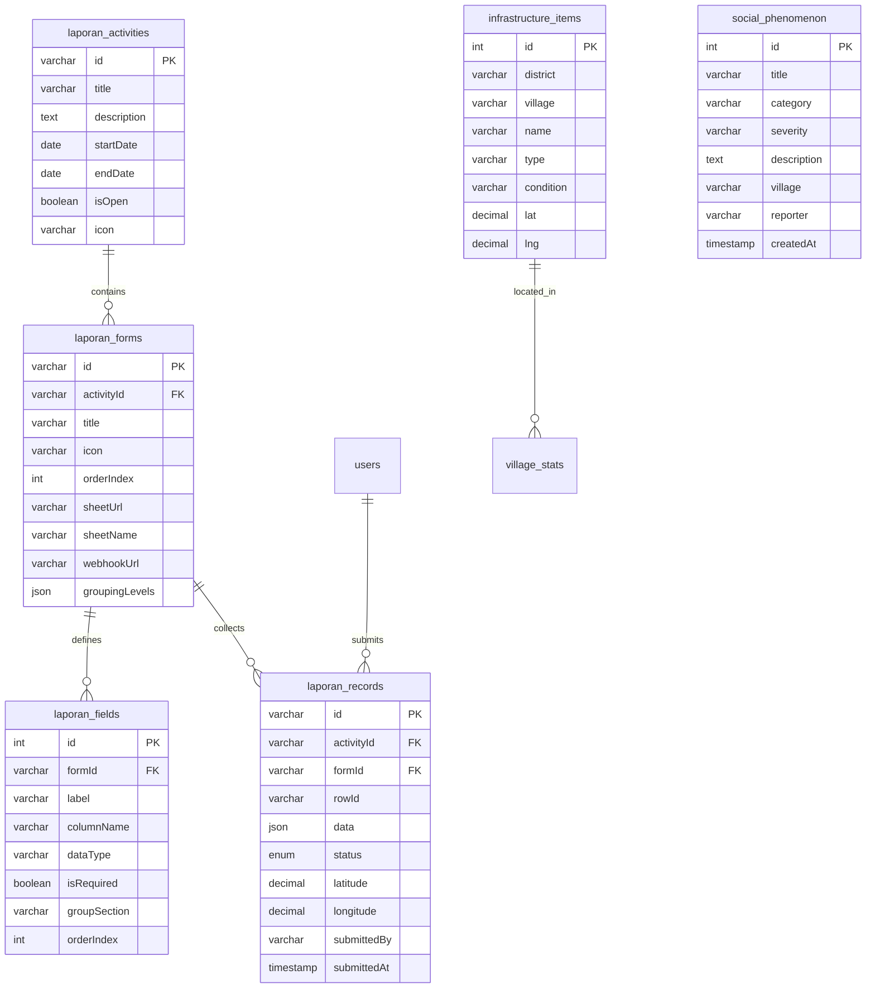
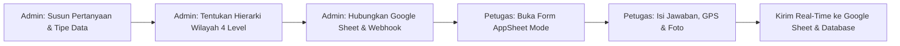

# Garda Data: Dokumentasi Teknis & Fungsional Sistem (Edisi Lengkap)

> **Platform Terpadu Menjaga Kualitas Data & Akuntabilitas Proses Pendataan**  
> Dibangun oleh Tim BPS Kabupaten Mempawah (IPDS 6104)

Dokumen ini merupakan referensi teknis komprehensif yang menguraikan arsitektur sistem, pilihan teknologi, desain antarmuka, logika *backend*, skema basis data relasional, mekanisme integrasi awan dua arah, serta panduan operasional lengkap untuk seluruh modul di Garda Data.

---

## Daftar Isi
1. [Gambaran Umum Sistem & Latar Belakang](#1-gambaran-umum-sistem--latar-belakang)
2. [Arsitektur Frontend](#2-arsitektur-frontend)
3. [Arsitektur Backend & API](#3-arsitektur-backend--api)
4. [Skema Basis Data MySQL](#4-skema-basis-data-mysql)
5. [Detail Fungsionalitas Modul](#5-detail-fungsionalitas-modul)
   - [5.1 Modul Manajemen Laporan Pendataan (AppSheet Mode & Form Builder)](#51-modul-manajemen-laporan-pendataan-appsheet-mode--form-builder)
   - [5.2 Modul Penilaian Mitra Statistik](#52-modul-penilaian-mitra-statistik)
   - [5.3 Modul Klasifikasi KBLI 2025 & KBJI 2014](#53-modul-klasifikasi-kbli-2025--kbji-2014)
   - [5.4 Modul Pengukuran Luas Bangunan Geospasial](#54-modul-pengukuran-luas-bangunan-geospasial)
   - [5.5 Modul Simulator Imputasi Susenas-Seruti](#55-modul-simulator-imputasi-susenas-seruti)
   - [5.6 Modul Infrastruktur Desa & Peta Wilayah](#56-modul-infrastruktur-desa--peta-wilayah)
   - [5.7 Modul Pelatihan Petugas (LMS)](#57-modul-pelatihan-petugas-lms)
   - [5.8 Modul Fenomena Sosial Ekonomi](#58-modul-fenomena-sosial-ekonomi)
   - [5.9 Dashboard Data Strategis BPS](#59-dashboard-data-strategis-bps)
6. [Integrasi Google Sheet 2 Arah & Manajemen Kuesioner](#6-integrasi-google-sheet-2-arah--manajemen-kuesioner)
7. [Sistem Tema Dinamis (6 Dynamic Presets)](#7-sistem-tema-dinamis-6-dynamic-presets)
8. [Panduan Deployment ke Production](#8-panduan-deployment-ke-production)
9. [Keamanan, Performa & Skalabilitas](#9-keamanan-performa--skalabilitas)

---

## 1. Gambaran Umum Sistem & Latar Belakang

### 1.1 Latar Belakang & Motivasi
Pengumpulan data statistik primer di lapangan menghadapi berbagai dinamika operasional:
- **Kompleksitas Instrumen:** Setiap survei atau sensus (Susenas, Sakernas, Sutas, SE, ST, dll.) memiliki struktur kuesioner dan metodologi yang berbeda.
- **Pencarian Kode Baku Lapangan:** Tebalnya buku pedoman fisik Klasifikasi Baku Lapangan Usaha Indonesia (KBLI) dan Klasifikasi Baku Jabatan Indonesia (KBJI) memperlambat waktu pencacahan.
- **Validasi Nilai Konsumsi:** Perlunya acuan cepat nilai batas wajar (imputasi) komoditas makanan dan non-makanan saat verifikasi data responden.
- **Kondisi Sinyal Pedesaan:** Diperlukannya mekanisme draf lokal (*offline-resilient*) agar data responden tidak hilang saat gawai kehabisan daya atau sinyal terputus.
- **Kebutuhan Kolaborasi Spreadsheet:** Tim teknis di BPS umumnya mengandalkan Google Sheet untuk pemantauan alokasi beban tugas. Dibutuhkan sinkronisasi dua arah yang interaktif dan mudah tanpa memerlukan keahlian pemrograman lanjutan.

Garda Data hadir sebagai ekosistem terpadu yang menyatukan *dynamic form builder*, sinkronisasi dua arah Google Sheet, geolokasi GPS, pengukuran luas bangunan satelit, simulator imputasi, pemetaan infrastruktur desa, evaluasi mitra statistik, dan *e-learning* (LMS) dalam satu aplikasi web progresif yang tangguh.

### 1.2 Profil Pengguna (*User Roles*)
Sistem menerapkan kontrol akses berbasis peran (*Role-Based Access Control* - RBAC):

| Role | Hak Akses & Kemampuan | Modul Utama yang Digunakan |
|---|---|---|
| **Admin** | Akses penuh ke seluruh konfigurasi sistem, pembuatan kegiatan, perancangan formulir, monitoring progres, manajemen data strategis, dan evaluasi mitra | Form Builder, Google Sheet Integration, Admin Dashboard, Penilaian Mitra, Strategic Data, Infrastruktur Desa |
| **Petugas** | Akses operasional pengumpulan data lapangan | Kuesioner Lapangan (AppSheet View), GPS Geotagging, Pencarian KBLI/KBJI, Simulator Imputasi, LMS Pelatihan, Lapor Fenomena |
| **Pengunjung** | Akses publik (*read-only*) | Data Strategis Daerah, Direktori Fasilitas Infrastruktur Desa, Navigasi Umum |

---

## 2. Arsitektur Frontend

### 2.1 Stack Teknologi Frontend
| Teknologi | Versi | Peran & Rationale |
|---|---|---|
| **React** | 18.x | Library antarmuka berbasis komponen deklaratif dan reaktif |
| **Vite** | 6.x | *Build tool* generasi baru dengan *Hot Module Replacement* (HMR) berkecepatan tinggi |
| **TypeScript** | 5.x | *Static typing* ketat untuk mencegah *runtime errors* pada manipulasi data survei kompleks |
| **Tailwind CSS** | v4 | Utilitas CSS modern dengan arsitektur `@theme` dan integrasi *CSS custom properties* |
| **Framer Motion** | Latest | Animasi transisi halaman, modal, *drawer*, dan umpan balik interaktif |
| **Lucide React** | Latest | Kumpulan ikon grafis SVG modular dan konsisten |
| **Leaflet & React-Leaflet** | Latest | Peta interaktif, visualisasi titik fasilitas, dan digitasi poligon geospasial |
| **xlsx (SheetJS)** | Latest | Generator dan pengurai file spreadsheet Excel/CSV langsung di sisi peramban (*client-side*) |

### 2.2 Strategi Optimasi Bundle: Code Splitting
Semua modul utama di-*load* secara dinamis (*lazy loading*) menggunakan `React.lazy()` dan `Suspense`. Hal ini menjaga bundle awal tetap kecil (~390 KB gzip) sehingga aplikasi dapat terbuka dalam waktu <2 detik bahkan pada koneksi seluler 3G/4G di daerah pedesaan:

```typescript
// App.tsx
const AdminLaporanManager = React.lazy(() => import('./components/laporan/AdminLaporanManager'));
const PetugasLaporanModule = React.lazy(() => import('./components/laporan/PetugasLaporanModule'));
const PenilaianMitraModule = React.lazy(() => import('./components/mitra/PenilaianMitraModule'));
const BuildingAreaModule = React.lazy(() => import('./components/BuildingAreaModule'));
const InfrastructureModule = React.lazy(() => import('./components/InfrastructureModule'));
const ImputationModule = React.lazy(() => import('./components/imputation/ImputationModule'));
const ClassificationModule = React.lazy(() => import('./components/ClassificationModule'));
const LMSModule = React.lazy(() => import('./components/LMSModule'));
const SocialPhenomenonModule = React.lazy(() => import('./components/SocialPhenomenonModule'));
```

### 2.3 Manajemen Sesi & State
- **Global Auth (`src/lib/auth.tsx`):** Mengelola sesi pengguna aktif (ID, username, email, role) yang tersimpan secara aman di `localStorage`.
- **Global Theme (`src/lib/theme.tsx`):** Mengelola preferensi warna tema aktif dengan manipulasi atribut `data-theme` pada root HTML tanpa memicu re-render virtual DOM React.
- **State Navigasi Berbasis State (`App.tsx`):** Menggunakan state machine internal (`currentModule`, `selectedActivityId`, `selectedFormId`) yang memungkinkan transisi mulus antar modul tanpa reload halaman penuh.
- **Penyimpanan Draf Lokal:** Kuesioner lapangan mengadopsi sinkronisasi draf lokal di `localStorage` per baris sampel, menjamin keamanan data responden saat baterai gawai habis mendadak.

---

## 3. Arsitektur Backend & API

Backend Garda Data berupa server REST API mandiri yang dibangun dengan Node.js dan Express.js, terhubung ke basis data relasional MySQL menggunakan *Connection Pooling*.

### 3.1 Stack Teknologi Backend
| Komponen | Spesifikasi | Fungsi |
|---|---|---|
| **Runtime** | Node.js (v18+ LTS) | Eksekusi server-side JavaScript performa tinggi |
| **Framework** | Express.js 4.x | Routing RESTful dan middleware handler |
| **Database Driver** | `mysql2/promise` | Driver koneksi MySQL asinkron berbasis Promise/async-await |
| **File Handler** | `multer` | Penanganan upload berkas foto dan dokumen survei ke storage server |
| **Keamanan** | `helmet`, `cors` | Penyetelan HTTP Security Headers dan proteksi Cross-Origin Resource Sharing |

### 3.2 Struktur Direktori Backend
```
backend/
├── routes/
│   ├── classification.js   # Endpoint pencarian KBLI 2025 & KBJI 2014
│   ├── infrastructure.js   # Endpoint inventarisasi infrastruktur desa
│   ├── laporan.js          # Endpoint kegiatan, formulir, pertanyaan, records, & webhook
│   └── social.js           # Endpoint pencatatan fenomena sosial ekonomi
├── uploads/
│   └── laporan/            # Direktori penyimpanan foto & berkas laporan lapangan
├── db.js                   # Connection Pool MySQL & Auto-Migration Skema
└── server.js               # Entry point Express API, middleware, & static file serving
```

### 3.3 Katalog REST API Utama
| Method | Endpoint | Deskripsi | Hak Akses |
|---|---|---|---|
| `GET` | `/api/status` | Pemeriksaan kesehatan server (*health check*) | Publik |
| `GET` | `/api/laporan/activities` | Mengambil daftar seluruh kegiatan survei/sensus | Publik / Petugas |
| `POST` | `/api/laporan/activities` | Membuat kegiatan survei baru | Admin |
| `PUT` | `/api/laporan/activities/:id` | Memperbarui nama, tanggal, ikon, atau status buka/tutup kegiatan | Admin |
| `DELETE` | `/api/laporan/activities/:id` | Menghapus kegiatan beserta seluruh formulir dan datanya | Admin |
| `GET` | `/api/laporan/activities/:actId/forms` | Mengambil daftar formulir di dalam suatu kegiatan | Publik / Petugas |
| `POST` | `/api/laporan/activities/:actId/forms` | Menambahkan formulir baru ke dalam kegiatan | Admin |
| `PUT` | `/api/laporan/forms/:formId` | Mengubah konfigurasi formulir (judul, ikon, link Sheet, webhook, grouping) | Admin |
| `DELETE` | `/api/laporan/forms/:formId` | Menghapus formulir beserta seluruh pertanyaan dan records | Admin |
| `GET` | `/api/laporan/forms/:formId/fields` | Mengambil daftar pertanyaan dan tipe data pada formulir | Petugas / Admin |
| `POST` | `/api/laporan/forms/:formId/fields` | Menyimpan susunan pertanyaan formulir (*batch save*) | Admin |
| `POST` | `/api/laporan/forms/:formId/sync-sheet` | Menarik dan menyinkronkan data sasaran dari link Google Sheet | Admin |
| `GET` | `/api/laporan/forms/:formId/records` | Mengambil seluruh record data sampel responden | Petugas / Admin |
| `POST` | `/api/laporan/forms/:formId/records` | Menyimpan isian survei (draf / submit) dan meneruskan ke Webhook Sheet | Petugas / Admin |
| `POST` | `/api/laporan/upload` | Mengunggah foto atau berkas lampiran kuesioner ke server | Petugas / Admin |
| `GET` | `/api/classifications` | Pencarian kode KBLI 2025 dan KBJI 2014 | Petugas / Admin |
| `GET` | `/api/infrastructure` | Mengambil data inventarisasi infrastruktur desa | Petugas / Admin |
| `POST` | `/api/infrastructure` | Menambahkan data fasilitas infrastruktur desa baru | Admin |
| `GET` | `/api/social` | Mengambil daftar catatan fenomena sosial ekonomi | Petugas / Admin |
| `POST` | `/api/social` | Menambahkan catatan fenomena sosial ekonomi baru | Petugas / Admin |

---

## 4. Skema Basis Data MySQL

Sistem mengadopsi skema relasional dengan fitur *Auto-Migration* pada `backend/db.js`. Saat server dijalankan pertama kali, tabel dibuat dan disesuaikan otomatis jika belum ada:



### Rincian Tabel Utama:

#### 1. Tabel `laporan_activities` (Kegiatan Survei/Sensus)
Menyimpan payung kegiatan statistik (contoh: *Susenas Maret 2026*, *Sakernas Agustus 2026*).
- `id` (VARCHAR 100, PK)
- `title` (VARCHAR 255, NOT NULL)
- `description` (TEXT)
- `startDate`, `endDate` (DATE)
- `isOpen` (TINYINT 1 DEFAULT 1): Kontrol buka/tutup akses kuesioner bagi petugas.
- `icon` (VARCHAR 50 DEFAULT 'Layers'): Ikon tematik Lucide yang dipilih admin.

#### 2. Tabel `laporan_forms` (Formulir Instrumen Survei)
Menyimpan sub-formulir dalam satu kegiatan (contoh: *Pencacahan Rumah Tangga*, *Pemeriksaan PML*).
- `id` (VARCHAR 100, PK)
- `activityId` (VARCHAR 100, FK ke `laporan_activities`)
- `title` (VARCHAR 255, NOT NULL)
- `icon` (VARCHAR 50 DEFAULT 'FileText')
- `orderIndex` (INT DEFAULT 0)
- `sheetUrl` (VARCHAR 500): Tautan Google Sheet master data sasaran.
- `sheetName` (VARCHAR 100): Nama lembar tab pada spreadsheet.
- `webhookUrl` (VARCHAR 500): Tautan Apps Script Webhook untuk pengiriman laporan real-time.
- `groupingLevels` (JSON): Array 4 kolom pengelompokan hierarki petugas (*drill-down*).

#### 3. Tabel `laporan_fields` (Daftar Pertanyaan & Variabel)
Menyimpan definisi kolom kuesioner yang dirancang admin.
- `id` (INT AUTO_INCREMENT, PK)
- `formId` (VARCHAR 100, FK ke `laporan_forms`)
- `label` (VARCHAR 255): Teks pertanyaan untuk petugas.
- `columnName` (VARCHAR 100): Nama variabel / header kolom database.
- `dataType` (ENUM: `'teks'`, `'angka'`, `'lokasi'`, `'file'`, `'tanggal'`, `'jam'`).
- `isRequired` (TINYINT 1 DEFAULT 0): Penanda pertanyaan wajib diisi sebelum submit.
- `orderIndex` (INT DEFAULT 0)

#### 4. Tabel `laporan_records` (Data Isian Laporan Petugas)
Menyimpan baris data responden/sampel survei.
- `id` (VARCHAR 100, PK)
- `activityId` (VARCHAR 100, FK)
- `formId` (VARCHAR 100, FK)
- `rowId` (VARCHAR 100): Identifier unik baris responden (contoh: ID Rumah Tangga / Kode Sampel).
- `data` (JSON): Kumpulan pasangan kunci-nilai jawaban kuesioner dan data sasaran awal.
- `status` (ENUM: `'draft'`, `'submitted'` DEFAULT `'draft'`).
- `latitude`, `longitude` (DECIMAL 10,8 & 11,8): Koordinat GPS lokasi pendataan.
- `submittedBy` (VARCHAR 100): Nama petugas pelapor.
- `submittedAt` (TIMESTAMP): Waktu penyerahan laporan akhir.

#### 5. Tabel `infrastructure_items` & `village_stats`
Menyimpan inventarisasi sarana fisik dan rekapitulasi kependudukan di 60 desa pada 9 kecamatan Kabupaten Mempawah.
- Kolom: `district`, `village`, `name`, `type`, `condition`, `lat`, `lng`, `source`.

#### 6. Tabel `social_phenomenon`
Menyimpan log observasi kualitatif sosial ekonomi di lapangan.
- Kolom: `title`, `category`, `severity`, `description`, `village`, `reporter`, `status`, `createdAt`.

---

## 5. Detail Fungsionalitas Modul

### 5.1 Modul Manajemen Laporan Pendataan (AppSheet Mode & Form Builder)
Modul ini merupakan inti operasional pengumpulan data lapangan Garda Data:



- **Alur Perancangan Formulir 3 Langkah (Admin):**
  1. **Langkah 1 (Pertanyaan & Jenis Data):** Menyusun daftar variabel survei dengan memilih tipe data yang sesuai:
     - `teks`: Input string bebas / uraian.
     - `angka`: Nilai numerik (jumlah ART, pendapatan, luas).
     - `lokasi`: Koordinat lintang dan bujur otomatis dari sensor GPS gawai.
     - `file`: Unggah dokumen atau ambil foto langsung dengan kamera gawai.
     - `tanggal` & `jam`: Pemilih waktu terstandar ISO.
  2. **Langkah 2 (Pengelompokan Jenis Data & Hierarki):** Menentukan urutan pengelompokan tampilan sampel petugas (Level 1 hingga Level 4, contoh: *Kecamatan > Desa > SLS > No. Responden*).
  3. **Langkah 3 (Koneksi Google Sheet):** Memasukkan link Google Sheet sasaran untuk ditarik ke aplikasi dan menyalin skrip Webhook Apps Script untuk penerimaan hasil laporan.
- **Pemilih Ikon Visual (Icon Visual Picker):** Admin dapat memilih dari 17 ikon Lucide tematik (`Layers`, `FileText`, `ClipboardList`, `Building2`, `Home`, `Users`, `MapPin`, `BarChart3`, `Wheat`, `Truck`, `HeartPulse`, `GraduationCap`, `DollarSign`, `Search`, `Calendar`, `Camera`, `CheckCircle2`) untuk merepresentasikan kegiatan dan formulir secara visual.
- **Mode Petugas Lapangan (Mobile AppSheet View):**
  - Tampilan kartu responden dengan hierarki navigasi *drill-down* akordion.
  - Indikator persentase kelengkapan isian (*progress bar* % terisi) pada setiap sampel.
  - Tombol deteksi koordinat GPS instan (*One-tap Geolocation*).
  - Kamera dan *file upload* terintegrasi ke storage server.
  - Penyimpanan draf *offline-resilient* dan filter status responden (*Semua*, *Draf*, *Terkirim*).
- **Dashboard Monitoring & Rekapitulasi Data:** Admin dapat memantau grafik rasio capaian target, draf tersimpan, dan data terkirim, serta melakukan pencarian dan ekspor tabel rekapitulasi.

---

### 5.2 Modul Penilaian Mitra Statistik
Sistem evaluasi berkala kinerja mitra lapangan (pendata/PCL dan pengawas/PML) untuk menjamin akuntabilitas dan standardisasi rekam jejak:

- **Kriteria Evaluasi Multi-Parameter:**
  1. **Kualitas Isian Data & Kelengkapan Kuesioner** (Bobot: 35%): Konsistensi logika antar pertanyaan, ketiadaan data kosong tanpa keterangan.
  2. **Ketepatan Waktu & Pencapaian Target Beban Kerja** (Bobot: 30%): Ketepatan penyelesaian tugas sebelum batas akhir jadwal survei.
  3. **Kedisiplinan, Integritas & Etika Lapangan** (Bobot: 20%): Sikap sopan kepada responden, kehadiran pada saat briefing, kepatuhan SOP.
  4. **Pemahaman Konsep & Definisi Operasional** (Bobot: 15%): Kemampuan mengidentifikasi konsep statistik secara benar di lapangan.
- **Validasi Catatan Evaluasi Kualitatif:** Wajib mengisi catatan evaluasi lapangan dengan panjang **minimal 10 karakter** sebelum nilai dapat disimpan ke database untuk mencegah evaluasi asal-asalan dan menjaga akuntabilitas penilaian.
- **Formula Skor Akhir Terbobot:**
  $$\text{Skor Akhir} = \sum_{i=1}^{n} (w_i \times s_i)$$
- **Kategori Predikat Kinerja (Badges):**
  - **Sangat Baik** ($Skor \ge 85$): Rekomendasi prioritas untuk penugasan survei berikutnya.
  - **Baik** ($70 \le Skor < 85$): Memenuhi standar operasional BPS.
  - **Cukup** ($60 \le Skor < 70$): Memerlukan supervisi tambahan.
  - **Perlu Pembinaan** ($Skor < 60$): Evaluasi khusus sebelum penugasan ulang.
- **Fitur Penunjang:** Rekap riwayat evaluasi historis mitra, pencarian nama mitra/SOBAT ID, penghitung karakter catatan real-time, dan ekspor lembar evaluasi kinerja.

---

### 5.3 Modul Klasifikasi KBLI 2025 & KBJI 2014
Mesin pencari pintar direktori klasifikasi baku statistik:
- **KBLI 2025:** Klasifikasi Baku Lapangan Usaha Indonesia versi 2025 dengan struktur 5 digit untuk penentuan sektor ekonomi usaha.
- **KBJI 2014:** Klasifikasi Baku Jabatan Indonesia dengan struktur 4 digit untuk standardisasi jenis pekerjaan/profesi responden.
- **Mekanisme Pencarian (*Fuzzy Matching & Debounce*):** Petugas cukup mengetikkan istilah percakapan sehari-hari (contoh: *"jual gorengan"*, *"supir sawit"*, *"tukang las"*), sistem akan mencocokkan kata kunci ke uraian resmi secara instan dengan teknik *debouncing* 300ms untuk efisiensi kueri.
- **Fitur Cepat:** Salin kode instan ke *clipboard* dan penyaringan berdasarkan kategori/golongan pokok.

---

### 5.4 Modul Pengukuran Luas Bangunan Geospasial
Alat bantu petugas dan admin untuk mengukur dan memverifikasi luas permukaan bangunan tempat tinggal atau tempat usaha secara presisi di atas citra satelit resolusi tinggi:

- **Digitasi Poligon Interaktif (Leaflet Draw):** Pengguna dapat meletakkan titik-titik simpul (vertex) mengikuti bentuk fisik atap bangunan pada peta satelit.
- **Formula Perhitungan Luas Geodesik (Formula Gauss / Shoelace Algorithm):**
  $$A = \frac{1}{2} \left| \sum_{i=1}^{n} (x_i y_{i+1} - x_{i+1} y_i) \right|$$
  Sistem mengonversi koordinat lintang/bujur (derajat) ke satuan luas meter persegi ($m^2$) secara *real-time* dengan koreksi proyeksi kelengkungan bumi.
- **Dashboard Admin Pengukuran:** Menyimpan arsip data luas bangunan, koordinat pusat, nama pemilik/responden, waktu pengukuran, dan visualisasi spasial kembali ke peta.

---

### 5.5 Modul Simulator Imputasi Susenas-Seruti
Pusat referensi dan kalkulator interaktif nilai wajar konsumsi dan pengeluaran komoditas:

- **Engine Pencarian Standar Nilai Wajar:** Memuat rentang harga batas bawah, batas tengah (*median*), dan batas atas untuk ratusan komoditas bahan makanan, minuman, tembakau, energi, dan barang bukan makanan.
- **Kalkulator Multi-Baris Dinamis:**
  - Petugas dapat menambahkan baris perhitungan tanpa batas untuk simulasi berbagai komoditas sekaligus.
  - Perhitungan subtotal otomatis per baris:
    $$\text{Subtotal} = \text{Nilai Satuan} \times \text{Jumlah Kasus / Frekuensi}$$
  - Kalkulasi **Grand Total Pengeluaran** secara *real-time*.
- **Ketahanan State (*Persistent Tab Switching*):** Nilai input dan daftar baris komoditas tetap tersimpan di memori saat petugas berpindah ke tab lain (misal mencari referensi) lalu kembali lagi ke tab kalkulator.

---

### 5.6 Modul Infrastruktur Desa & Peta Wilayah
Sistem Informasi Geospasial (SIG) dan inventarisasi fasilitas umum untuk 60 desa di 9 kecamatan Kabupaten Mempawah:

- **Cakupan Wilayah 9 Kecamatan:**
  1. Mempawah Hilir
  2. Mempawah Timur
  3. Sungai Pinyuh
  4. Anjongan
  5. Toho
  6. Sadaniang
  7. Segedong
  8. Jongkat (Siantan)
  9. Sungai Kunyit
- **Kategori Sarana Fisik:** Sarana Pendidikan (SD, SMP, SMA), Fasilitas Kesehatan (Puskesmas, Poskesdes, Klinik), Tempat Ibadah (Masjid, Gereja, Vihara), Titik Perekonomian (Pasar, Sentra Usaha), dan Kantor Pemerintahan Desa.
- **Mekanisme Auto-Seeding Cadangan:** Jika server basis data baru diinisialisasi atau mengalami latensi, sistem frontend secara otomatis memuat data dasar wilayah (*seed data*) sehingga peta dan statistik desa tidak pernah kosong.
- **Fitur Manajemen Data:** Import/Export format Excel dan penambahan titik koordinat baru secara langsung.

---

### 5.7 Modul Pelatihan Petugas (LMS)
Learning Management System terpadu untuk penguatan pemahaman konsep dan metodologi survei bagi calon petugas sebelum bertugas di lapangan:

- **Kategori Materi Pembelajaran:** Modul Survei Sosial & Kesejahteraan Rakyat, Survei Ketenagakerjaan & Ekonomi, Metodologi Sensus & Geospasial, serta Etika & Standar Pelayanan Statistik.
- **Penyematan Multi-Media:**
  - *Viewer PDF Interaktif:* Pembacaan buku pedoman pencacahan langsung di dalam aplikasi.
  - *Streaming Video Edukasi:* Pemutaran video materi konsep survei dari YouTube / Google Drive.
  - *Tautan Sesi Interaktif:* Tombol peluncuran langsung ke ruang virtual Zoom / Google Meet dan kuis evaluasi Google Form.
- **Pelacak Progres Pembelajaran:** Status penyelesaian materi per petugas untuk memastikan seluruh modul telah dipelajari sebelum penugasan.

---

### 5.8 Modul Fenomena Sosial Ekonomi
Kanal pencatatan peristiwa dan dinamika kualitatif di lapangan yang berpotensi memengaruhi indikator statistik daerah:

- **Kategori Fenomena:** Pertanian & Perkebunan (gagal panen, perubahan musim), Perdagangan & Harga (kenaikan harga bahan pokok), Industri & Ketenagakerjaan (PHK massal, pembukaan sentra usaha baru), Bencana Alam (banjir, kemarau panjang), dan Kebijakan Pemerintah Daerah.
- **Tingkat Keparahan (*Severity Level*):** Rendah, Sedang, Tinggi, dan Kritis.
- **Pelaporan Berbasis Bukti:** Mendukung deskripsi naratif terperinci, lokasi desa kejadian, estimasi dampak, dan lampiran dokumentasi foto.
- **Pemanfaatan Data:** Menjadi bahan rujukan analisis dalam penyusunan Berita Resmi Statistik (BRS) dan publikasi Daerah Dalam Angka (DDA).

---

### 5.9 Dashboard Data Strategis BPS
Penyajian indikator makro ekonomi dan sosial utama Kabupaten Mempawah:

- **Indikator Makro yang Disajikan:**
  - **Laju Inflasi** (Persentase Perubahan Indeks Harga Konsumen - IHK YoY & MoM)
  - **Persentase Penduduk Miskin (P0)** & Garis Kemiskinan (GK)
  - **Tingkat Pengangguran Terbuka (TPT)** & Tingkat Partisipasi Angkatan Kerja (TPAK)
  - **Produk Domestik Regional Bruto (PDRB)** atas dasar harga berlaku (ADHB) & konstan (ADHK)
  - **Indeks Pembangunan Manusia (IPM)**
- **Manajemen Data Berbasis Role:** Hanya akun dengan role **Admin** yang memiliki wewenang untuk memperbarui angka indikator, tahun rilis, dan ringkasan eksekutif publikasi.

---

## 6. Integrasi Google Sheet 2 Arah & Manajemen Kuesioner

Garda Data menerapkan mekanisme integrasi awan dua arah yang **sangat ramah bagi pengguna awam** tanpa memerlukan keahlian pemrograman:

```mermaid
flowchart TD
    subgraph Arah 1: Google Sheet ke Aplikasi
        A1["1. Admin Klik 'Download Format Excel'"] --> A2["2. Buka Google Sheet & Salin Format Tabel"]
        A2 --> A3["3. Isi Daftar Target Responden"]
        A3 --> A4["4. Tempelkan Link Sheet & Klik 'Tarik Data'"]
        A4 --> A5["📱 Sampel Responden Muncul di HP Petugas"]
    end

    subgraph Arah 2: Aplikasi ke Google Sheet
        B1["5. Petugas Isi Kuesioner, Koordinat GPS & Foto"] --> B2["6. Petugas Klik 'Submit Laporan'"]
        B2 --> B3["7. Webhook Apps Script Menerima Data"]
        B3 --> B4["📊 Baris Responden di Google Sheet Terisi Real-Time"]
    end
```



### Petunjuk Penggunaan Praktis:

#### A. Menarik Data Target dari Google Sheet (Arah 1)
1. Pada menu Admin Form Builder, buat pertanyaan dan susun pengelompokan wilayah.
2. Klik tombol **"Download Format Excel"**. Buka file tersebut lalu salin (*copy-paste*) ke Google Sheet Anda.
3. Bagikan Google Sheet dengan akses: **"Siapa saja yang memiliki link dapat melihat (Viewer)"**.
4. Salin tautan Google Sheet dan masukkan nama lembar (*Sheet Name*) pada formulir Garda Data.
5. Tekan tombol **"Tarik Data dari Google Sheet"**. Seluruh data sampel responden langsung terunduh dan siap dikerjakan oleh petugas di lapangan.

#### B. Mengirimkan Hasil Laporan Lapangan ke Google Sheet (Arah 2)
1. Klik tombol **"Lihat Cara Pasang (Mudah)"** di kartu Webhook.
2. Salin kode Google Apps Script yang disediakan.
3. Buka Google Sheet Anda, pilih menu **Ekstensi > Apps Script**, tempelkan kode tersebut, lalu klik **Terapkan (Deploy) > Deployment Baru**.
4. Pilih jenis **Aplikasi Web (Web App)**, atur *Akses* ke **Siapa Saja (Anyone)**, lalu klik **Deploy**.
5. Salin URL Web App yang dihasilkan dan tempelkan ke kolom **Link Webhook Google Sheet** di Garda Data.
6. Sekarang, setiap kali petugas menekan tombol **"Submit Laporan"** di lapangan, Google Sheet akan terisi secara otomatis dan *real-time*.

---

## 7. Sistem Tema Dinamis (6 Dynamic Presets)

Garda Data mengimplementasikan sistem tema dinamis tanpa *re-render* virtual DOM dengan memanfaatkan token variabel CSS pada Tailwind CSS v4 `@theme`:

```css
/* src/index.css */
@theme {
  --color-primary-500: var(--p-500, #8b5cf6);
  --color-secondary-500: var(--s-500, #f43f5e);
}
```

### Palet 6 Preset Warna Resmi:
1. **Persik JosJiz (Default - Electric Violet Lilac & Coral Peach):**
   - Karakter: Modern, berenergi tinggi, kombinasi ungu violet elektrik dan sentuhan koral persik (tema bawaan utama).
   - Primary: `#8b5cf6` | Secondary: `#f43f5e`
2. **Original (Warm Orange & Terracotta):**
   - Karakter: Enerjik, hangat, nuansa warm orange & terracotta klasik.
   - Primary: `#f17e3a` | Secondary: `#e29578`
3. **GreenTea (Fresh Mint, Teal, & Sage Green):**
   - Karakter: Sejuk, menenangkan, nuansa survei pertanian dan lingkungan hidup.
   - Primary: `#22c55e` | Secondary: `#14b8a6`
4. **Yellow World (Dominan Kuning Cerah & Golden Amber):**
   - Karakter: Ceria, optimis, terang, dan segar dengan palet kuning cerah dan aksen emas.
   - Primary: `#eab308` | Secondary: `#f59e0b`
5. **Notebook (Dominan Pink Pastel & Rose Blush):**
   - Karakter: Manis, ceria, estetik, dominan pink lembut yang nyaman di mata.
   - Primary: `#ec4899` | Secondary: `#f43f5e`
6. **Sky (Healthcare Blue & Crisp Professional Blue):**
   - Karakter: Formal, bersih, berstandar pelayanan publik prima.
   - Primary: `#007BFF` | Secondary: `#3B82F6`

---

## 8. Panduan Deployment ke Production

### 8.1 Konfigurasi Server Backend (Ubuntu 22.04 LTS / VPS)
```bash
# 1. Update paket OS dan instal Node.js serta MySQL
sudo apt update && sudo apt upgrade -y
curl -fsSL https://deb.nodesource.com/setup_20.x | sudo -E bash -
sudo apt install -y nodejs mysql-server git

# 2. Setup database MySQL
sudo mysql -u root
CREATE DATABASE garda_data CHARACTER SET utf8mb4 COLLATE utf8mb4_unicode_ci;
CREATE USER 'garda_user'@'localhost' IDENTIFIED BY 'PASSWORD_KUAT_ANDA';
GRANT ALL PRIVILEGES ON garda_data.* TO 'garda_user'@'localhost';
FLUSH PRIVILEGES;
EXIT;

# 3. Kloning repositori dan instal dependensi backend
git clone https://github.com/ipds6104/GardaData.git
cd GardaData/backend
npm install

# 4. Buat konfigurasi .env backend
cat > .env << 'EOF'
PORT=3000
DB_HOST=localhost
DB_USER=garda_user
DB_PASSWORD=PASSWORD_KUAT_ANDA
DB_NAME=garda_data
EOF

# 5. Jalankan backend dengan PM2 Process Manager
sudo npm install -g pm2
pm2 start server.js --name "garda-backend"
pm2 startup
pm2 save
```

### 8.2 Konfigurasi Frontend & Nginx Web Server
```bash
# 1. Masuk ke root direktori proyek dan tentukan API URL production
cd ../
echo "VITE_API_URL=https://api.domain-anda.com" > .env

# 2. Build production frontend bundle
npm install
npm run build

# 3. Salin hasil build ke direktori web Nginx
sudo cp -r dist/* /var/www/html/

# 4. Konfigurasi Nginx SPA Reverse Proxy (/etc/nginx/sites-available/default)
# server {
#     listen 80;
#     server_name domain-anda.com;
#     root /var/www/html;
#     index index.html;
#
#     location / {
#         try_files $uri $uri/ /index.html;
#     }
#
#     location /api/ {
#         proxy_pass http://localhost:3000/api/;
#         proxy_http_version 1.1;
#         proxy_set_header Upgrade $http_upgrade;
#         proxy_set_header Connection 'upgrade';
#         proxy_set_header Host $host;
#         proxy_cache_bypass $http_upgrade;
#     }
#
#     location /uploads/ {
#         proxy_pass http://localhost:3000/uploads/;
#     }
# }

# 5. Uji dan muat ulang Nginx
sudo nginx -t && sudo systemctl reload nginx
```

---

## 9. Keamanan, Performa & Skalabilitas

### 9.1 Standar Keamanan
- **Prepared Statements / Parameterized Queries:** Mencegah 100% risiko kerentanan SQL Injection pada seluruh operasi manipulasi data.
- **HTTP Security Headers (Helmet):** Mengaktifkan proteksi XSS (*Cross-Site Scripting*), pencegahan *MIME Sniffing*, dan mitigasi *Clickjacking*.
- **CORS Policy Terbatas:** Menolak akses API dari origin liar yang tidak diizinkan.
- **Validasi Berkas Unggahan:** Pembatasan ukuran maksimal 25 MB per berkas dan isolasi nama file menggunakan *cryptographic timestamping*.

### 9.2 Keandalan & Performa
- **PWA Service Worker & Workbox:** Aset statis (JavaScript, CSS, Ikon, Tile Peta) di-*cache* di browser pengguna untuk waktu muat instan (<1 detik) pada kunjungan berikutnya.
- **Connection Pooling MySQL:** Menjaga ketersediaan koneksi database saat terjadi lonjakan *traffic* submit bersamaan dari ratusan petugas di akhir periode survei.
- **Zero-Dependency Core:** Pemanfaatan protokol Web API bawaan (Geolocation, Canvas, LocalStorage) yang meminimalkan ukuran dependensi eksternal.

---

> **Garda Data Core Team**  
> *"Menjaga Kualitas Data, Memudahkan Kinerja Lapangan."*
